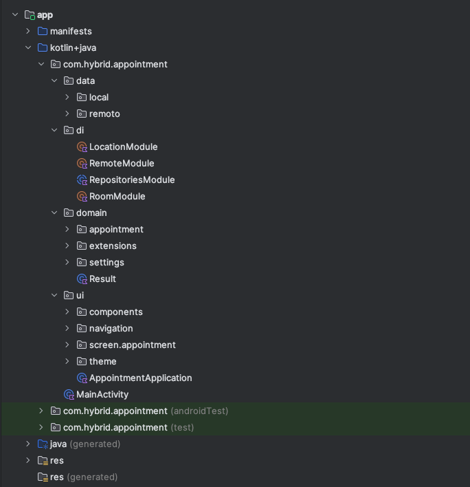

🚀 Instalación y ejecución
Clonar repositorio  
git clone https://github.com/LuisPaucarRodrigo/Appointment.git  
cd tu-proyecto  
Configurar SDK de Android  
Crear un archivo local.properties en la raíz del proyecto con la ruta de tu SDK local:  
sdk.dir=/ruta/a/tu/Android/sdk  
MAPS_API_KEY=Api key de maps  
Abrir en Android Studio  
Abrir el proyecto.  
Android Studio sincronizará Gradle automáticamente.  
Compilar y ejecutar  
Seleccionar un dispositivo físico o emulador.  
Ejecutar Run (Shift + F10).  
  
🏗 Arquitectura  
Arquitectura: MVVM (Model-View-ViewModel)  
Librerías principales:  
Jetpack Compose – para interfaces reactivas y declarativas.  
Retrofit – para consumo de API REST.  
Kotlin Coroutines + Flow – para manejo reactivo de datos.  
Google Maps Compose – para visualización de mapas y rutas.  
Estructura de carpetas:  
  
  
📝 Consideraciones Técnicas  
local.properties no debe subirse al repositorio.  
API keys u otras credenciales deben manejarse mediante gradle.properties o variables de entorno, no en el código ni en local.properties.  
La app requiere permisos de ubicación para funciones de GPS y mapas; se solicita en tiempo de ejecución.  
Compatible únicamente con Android 10 (API 29) o superior.